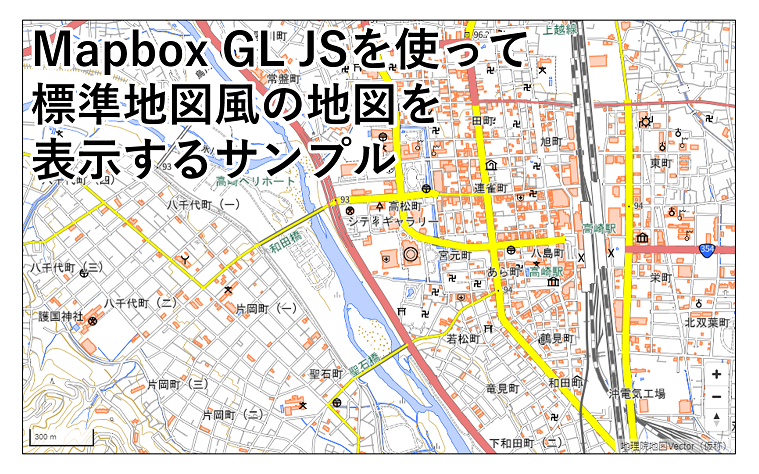

# Mapbox GL JSで地理院地図Vector風の地図を表示するサンプル

## 本レポジトリについて

[地理院地図Vector（仮称）](https://maps.gsi.go.jp/vector/)で提供しているベクトルタイルは、出典を明示いただければ、ご自分のサイトやアプリ等でもご利用いただけます。

本レポジトリでは、参考として、ベクトルタイルを表示する代表的なライブラリである[Mapbox GL JS](https://github.com/mapbox/mapbox-gl-js)を利用して、地理院地図Vectorのベクトルタイルを表示するサンプルを提供しています。

本サンプルを利用して構築したサイトには、出典の記載をお願いします。

出典の記載例：`<a href=”https://maps.gsi.go.jp/vector/” target=”blank”>地理院地図Vector（仮称）</a>`




## 表示されるベクトルタイルについて

本サンプルで表示するベクトルタイルのURLは以下の通りです。

```https://cyberjapandata.gsi.go.jp/xyz/experimental_bvmap/{z}/{x}/{y}.pbf```

ベクトルタイルの詳細については、以下のレポジトリをご覧ください。

[地理院地図Vector（仮称）提供実験](https://github.com/gsi-cyberjapan/gsimaps-vector-experiment)


## 地理院地図Vectorとの相違点

本サンプルのスタイル設定ファイル（style.json）は、[Style Specification](https://docs.mapbox.com/mapbox-gl-js/style-spec/)に準拠したものとなります。一方、地理院地図Vectorのstyle.jsonでは、Style Specificationをベースに、若干の拡張を施しています。そのため、地理院地図Vectorとは、地図の表示が異なる部分がございます。

地図の表示が異なる部分の例
* 建物等のハッチング表現は行わず、すべて塗りつぶしで表現しております。
* 注記は、すべて横書きとなっております。そのため、本来の注記位置とのずれ等、表示に不具合があることがあります。
	* 縦書きをできる限り表現したスタイル（後述のstd_vertical.json）も用意しておりますが、伸ばし棒「―」等が縦書き表示になりません。これは、Mapbox GL JSの仕様によるものです（2020年4月23日現在）。


## 本サンプルのstyle.json一覧

### std.json

地理院地図Vectorの標準地図をベースにしたスタイルです。

サンプルページ https://gsi-cyberjapan.github.io/gsivectortile-mapbox-gl-js/std.html

### std_vertical.json

上記、std.jsonに注記の縦書き表示の設定を加えたスタイルです。

サンプルページ https://gsi-cyberjapan.github.io/gsivectortile-mapbox-gl-js/std_vertical.html

### pale.json

地理院地図Vectorの淡色地図をベースにしたスタイルです。

サンプルページ https://gsi-cyberjapan.github.io/gsivectortile-mapbox-gl-js/pale.html

### blank.json

地理院地図Vectorの白地図をベースにしたスタイルです。

サンプルページ https://gsi-cyberjapan.github.io/gsivectortile-mapbox-gl-js/blank.html


## 注意事項

本レポジトリのスタイルファイルは実験的に提供しているものです。予告なく削除する可能性があります。

本レポジトリのスタイルファイルの利用により生じた損失及び損害等について、国土地理院はいかなる責任も負わないものとします。

